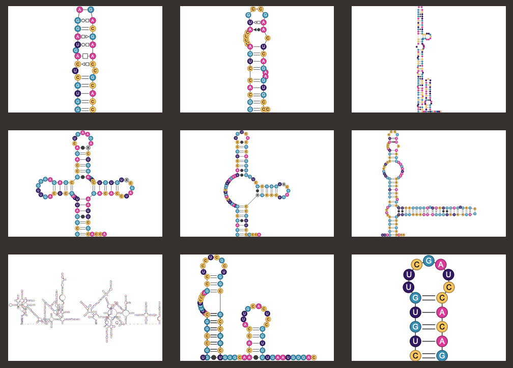

# RNA Gallery



RNA Gallery is a project derived from the framework [RNArtistCore](https://github.com/fjossinet/RNArtistCore) and the graphical tool [RNArtist](https://github.com/fjossinet/RNArtist). Its goal is to provide pre-computed drawings for RNA structures stored in databases like [the Protein Data Bank](https://www.rcsb.org) or [Rfam](https://rfam.xfam.org).

You can get the drawings as JSON files have to be opened and modified with the graphical tool [RNArtist](https://github.com/fjossinet/RNArtist). 

The largest majority of the 2D drawings will be rough outputs computed with the framework [RNArtistCore](https://github.com/fjossinet/RNArtistCore). Regularly, I will improve some drawings to make them less messy, or to fit the layouts depicted in publications.

## How to get and use the RNA Gallery

You can load each 2D drawing directly from [RNArtist](https://github.com/fjossinet/RNArtist) by giving the PDB ID and the chain identifier. RNArtist will download and display the 2D drawing, along with the 3D structure and link them together. 

You can also download the entire project as a zip file by following [this link](https://github.com/fjossinet/RNAGallery/archive/main.zip). Since some drawings will be updated, an even best way would be to use the command git (easy to install on any operating system) to clone this repository (```git clone https://github.com/fjossinet/RNAGallery.git```). This will allow you to get the updates without the need to re-download the entire project (```git update```).

## The Protein Data Bank Gallery

For more details, check [this file](PDB/status.md)

### The Rfam Gallery

To be released soon


